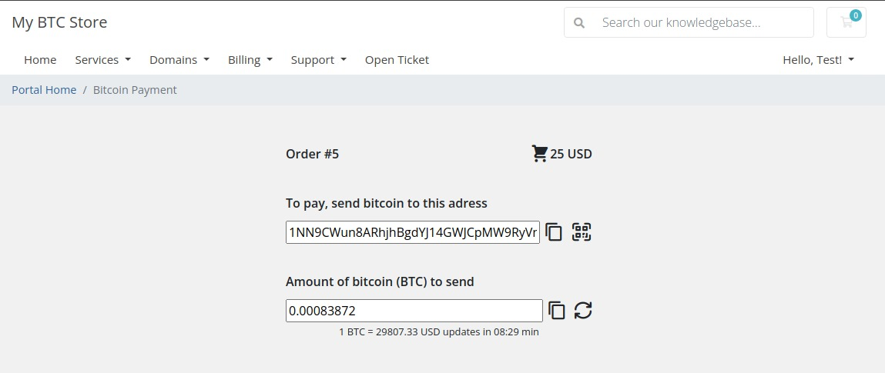
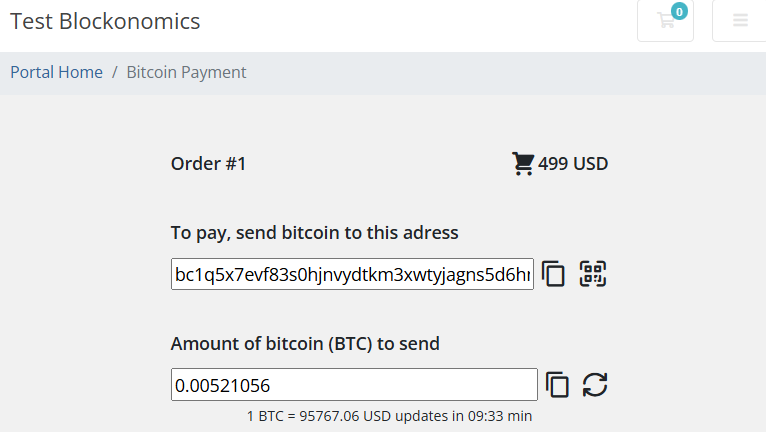
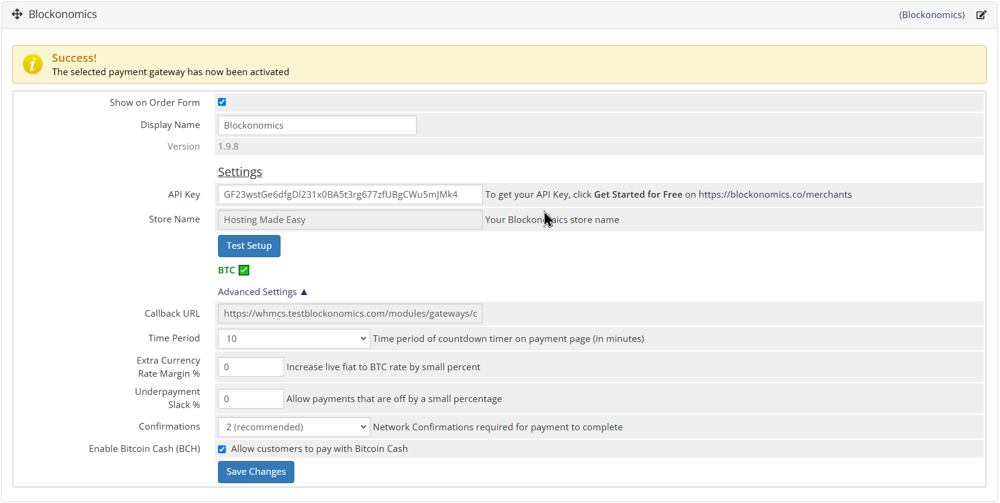

# Blockonomics WHMCS plugin #
Accept bitcoin, bitcoin cash and USDT (ETH ERC-20) on your WHMCS site, payments go directly into your wallet

## Description ##
- No middle man. Payment goes straight to your wallet
- On-site payment. Customers never leaves your store
- Fast and easy setup. No waiting for API approvals

## Installation

Follow the official setup guide:

**[WHMCS Blockonomics Setup Guide](<https://help.blockonomics.co/support/solutions/articles/33000293359-whmcs-blockonomics-setup-guide>)** | **[Video Tutorial](<https://www.youtube.com/watch?v=5ckRa-S9QVo>)**

### Quick Steps

**Step 1: Adding a Wallet to Blockonomics**
Follow the instructions [here](<https://help.blockonomics.co/support/solutions/articles/33000293836-blockonomics-website-tutorial#Adding-a-Wallet>) to add a BTC or USDT Wallet to your Blockonomics account. If you want to enable both BTC and USDT in checkout, please add both wallets.

**(Optional) BCH Setup**
If you wish to accept Bitcoin Cash (BCH), follow instructions [given here](<https://help.blockonomics.co/support/solutions/articles/33000251576>).

**Step 2: Install the WHMCS Plugin**
Download from [WHMCS Marketplace](<https://marketplace.whmcs.com/product/4029-whmcs-bitcoin-payments>) and upload the `modules` folder to your WHMCS installation.

## Screenshots ##

 
USDT checkout

 
Bitcoin checkout

 
Blockonomics configuration

