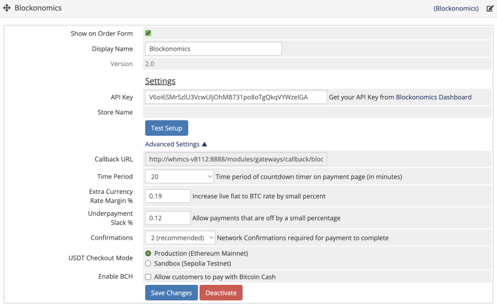

# Blockonomics WHMCS plugin #
Accept bitcoins on your WHMCS, payments go directly into your wallet

## Description ##
- Accept bitcoin payments on your website with ease
- No security risk, payments go directly into your own bitcoin wallet  

## Installation ##
[Blog Tutorial](https://insights.blockonomics.co/friendly-bitcoin-payments-for-web-hosting-businesses-using-whmcs/) | [Video Tutorial](https://www.youtube.com/watch?v=dcPHarWt3F4)

- Copy the folder `modules` to your root WHMCS directory
- Go to your WHMCS admin, Addons -> Apps & Integrations -> Browse -> Payments
- Click and activate Blockonomics in All Payment Apps
- Go to module settings and set your API key
- Hit Test Setup to confirm everything is setup correctly
- Cleanup on upgrade from 1.8.X to 1.9.X  (Optional): If you are upgrading from 1.8.X to 1.9.X, you can run *upgrade.php* to cleanup unecessary files. Execute the script *modules/gateways/blockonomics/upgrade.php* using your browser. Example: https://xxxxxxx.ccc/modules/gateways/blockonomics/upgrade.php (replace xxxxxxx.ccc with your own WHMCS domain)

## Screenshots ##

 
Checkout option

 
Select Crypto

 
Checkout screen

 
Blockonomics configuration

