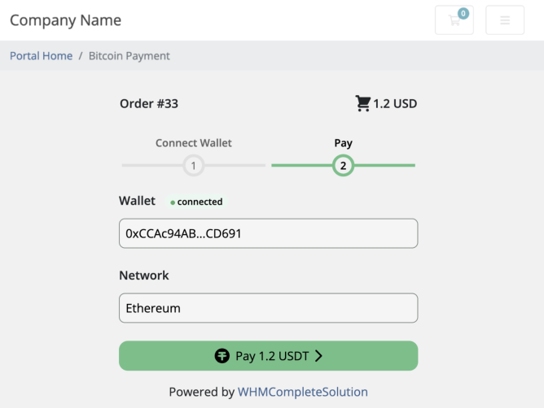

# Blockonomics WHMCS plugin #
Accept bitcoin, bitcoin cash and USDT (ETH ERC-20) on your WHMCS site, payments go directly into your wallet

## Description ##
- No middle man. Payment goes straight to your wallet
- On-site payment. Customers never leaves your store
- Fast and easy setup. No waiting for API approvals

## Installation ##
[Blog Tutorial](https://help.blockonomics.co/support/solutions/articles/33000293359-whmcs-blockonomics-setup-guide) | [Video Tutorial](https://www.youtube.com/watch?v=5ckRa-S9QVo)

## Screenshots ##

 
Checkout option

 
Select Crypto

 
Checkout screen

 
Blockonomics configuration

